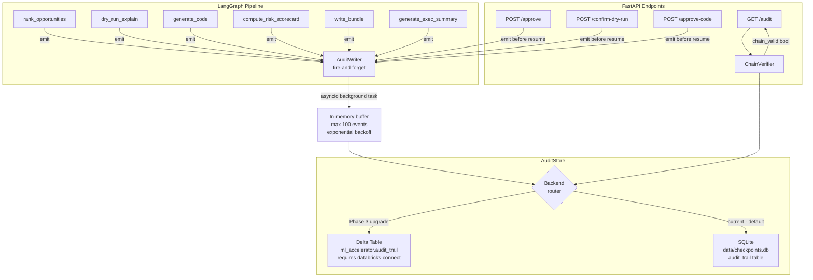

# Design Document — Audit Trail

## Overview

The Audit Trail feature adds an immutable, hash-chained event log to every ML Accelerator run. It answers the enterprise compliance question: "what did the AI decide, who approved it, and when?" — without touching the LangGraph checkpoint or LangSmith traces.

The design follows a fire-and-forget instrumentation pattern: a lightweight `AuditWriter` singleton is called at the end of each LangGraph node and at each FastAPI approval endpoint. Writes are dispatched as `asyncio` background tasks so they never block the pipeline. Events are stored in SQLite (`data/checkpoints.db`) — the same database already used for LangGraph checkpointing. A `ChainVerifier` recomputes SHA-256 hashes to detect tampering. A new `GET /runs/{run_id}/audit` endpoint exposes the full ordered log.

> **Storage note:** This product generates and promotes ML notebooks — it does not run them. The `ml_accelerator` schema in Unity Catalog is written by the *generated notebooks* when the customer runs them on their cluster, not by this app. Therefore, Delta table storage for the audit trail is a **Phase 3 upgrade** (when the product is packaged as a full Databricks App with `databricks-connect`). For now, SQLite is the correct and only backend.

### Design Goals

- Zero pipeline impact — audit instrumentation must be invisible to the agent's execution path
- Tamper evidence — SHA-256 hash chaining makes any modification detectable
- SQLite-first — no Spark, no cluster, no schema pre-creation required; works in the FastAPI process today
- Delta-ready — `AuditStore` interface is backend-agnostic; Delta backend added in Phase 3 with `CREATE SCHEMA IF NOT EXISTS` guard
- Complement, not duplicate — business events only; LangSmith owns LLM traces

---

## Architecture



### Key Design Decisions

**Fire-and-forget via asyncio**: Each `emit()` call schedules a coroutine with `asyncio.create_task()`. The calling node returns immediately. If the event loop is not running (sync context), a thread-pool executor is used as fallback.

**In-process buffer**: A bounded deque (max 100) holds events that failed to write. A background retry loop uses exponential backoff (1s, 2s, 4s, … up to 60s). Events beyond 100 are dropped with an ERROR log — the pipeline is never blocked.

**Hash computation before write**: `event_hash` and `prev_hash` are computed synchronously before the background task is dispatched. This ensures the chain is logically correct even if writes arrive out of order at the store (sequence_number is the authoritative ordering key).

**Sequence number assignment**: The `AuditWriter` maintains a per-run in-memory counter. On first emit for a run, it queries the store for the current max sequence_number and initialises the counter. Subsequent emits increment atomically. This avoids a round-trip per event while remaining correct across restarts (the counter is re-seeded from the store on first access after restart).

**SQLite-first, Delta-ready**: The app generates notebooks but does not run them — `ml_accelerator` schema in Unity Catalog is created by the customer's cluster when they run the generated notebooks, not by this app. SQLite (`data/checkpoints.db`) is therefore the correct primary backend. The `AuditStore` interface is backend-agnostic so `DeltaAuditStore` can be added in Phase 3 without touching the writer or verifier. When Delta is added, `ensure_table()` must issue `CREATE SCHEMA IF NOT EXISTS {catalog}.ml_accelerator` before the table creation.

**SQLite fallback detection**: Checked once at module import time via `os.getenv("DATABRICKS_HOST")`. The result is cached — no per-event environment check.

---

## Components and Interfaces

### AuditWriter

Singleton accessed via `get_audit_writer()`. Stateless except for the per-run sequence counter cache and the retry buffer.

```python
# audit/writer.py

class AuditWriter:
    def emit(
        self,
        run_id: str,
        event_type: str,          # controlled vocabulary
        actor: str,               # "agent" | "user"
        node_name: str,
        payload: dict,
        langsmith_run_id: str | None = None,
    ) -> None:
        """
        Construct an AuditEvent, compute hashes, and schedule a background write.
        Never raises. Returns immediately.
        """

def get_audit_writer() -> AuditWriter:
    """Return the process-level singleton."""
```

### AuditStore (abstract interface)

```python
# audit/store.py

class AuditStore(Protocol):
    def write(self, event: AuditEvent) -> None: ...
    def get_events(self, run_id: str) -> list[AuditEvent]: ...
    def get_max_sequence(self, run_id: str) -> int: ...  # returns 0 if no events
    def ensure_table(self) -> None: ...
```

Two concrete implementations:

- `SqliteAuditStore` — uses the existing `data/checkpoints.db` connection. **Current default — no Spark required.**
- `DeltaAuditStore` — uses `spark.sql` INSERT INTO for writes. **Phase 3 upgrade only.** Requires `databricks-connect` and `CREATE SCHEMA IF NOT EXISTS {catalog}.ml_accelerator` guard in `ensure_table()`.

### ChainVerifier

```python
# audit/verifier.py

class ChainVerifier:
    def verify(self, run_id: str) -> VerificationResult: ...

class VerificationResult(TypedDict):
    valid: bool
    event_count: int
    tampered_at_sequence: int | None   # None when valid=True
    reason: str | None                 # "hash_mismatch" | "chain_broken" | None
```

### AuditEvent (data model)

```python
# audit/models.py

class AuditEvent(TypedDict):
    event_id: str           # UUID4
    run_id: str
    sequence_number: int    # 1-based, monotonically increasing per run
    event_type: str         # see controlled vocabulary below
    actor: str              # "agent" | "user"
    node_name: str
    timestamp_utc: str      # ISO-8601 UTC, e.g. "2024-01-15T10:30:00.000000Z"
    payload: dict           # event-specific structured data
    prev_hash: str          # SHA-256 hex or "GENESIS"
    event_hash: str         # SHA-256 hex
```

**Controlled vocabulary for `event_type`:**

| event_type | actor | emitted by |
|---|---|---|
| `opportunity_ranked` | `agent` | `rank_opportunities` node |
| `dry_run_planned` | `agent` | `dry_run_explain` node |
| `code_generated` | `agent` | `generate_code` node |
| `risk_scorecard_computed` | `agent` | `compute_risk_scorecard` node |
| `bundle_written` | `agent` | `write_bundle` node |
| `exec_summary_generated` | `agent` | `generate_exec_summary` node |
| `opportunity_approved` | `user` | `POST /runs/{id}/approve` |
| `dry_run_confirmed` | `user` | `POST /runs/{id}/confirm-dry-run` |
| `code_approved` | `user` | `POST /runs/{id}/approve-code` (action=approve) |
| `code_regeneration_requested` | `user` | `POST /runs/{id}/approve-code` (action=regenerate) |

### Hash Computation

```python
# audit/hashing.py

def compute_event_hash(event: dict) -> str:
    """
    SHA-256 of canonical JSON: all fields except event_hash, keys sorted alphabetically.
    """
    fields = {k: v for k, v in event.items() if k != "event_hash"}
    canonical = json.dumps(fields, sort_keys=True, separators=(",", ":"), ensure_ascii=True)
    return hashlib.sha256(canonical.encode("utf-8")).hexdigest()
```

---

## Data Models

### Delta Table Schema (`ml_accelerator.audit_trail`)

```sql
CREATE TABLE IF NOT EXISTS ml_accelerator.audit_trail (
    event_id        STRING NOT NULL,
    run_id          STRING NOT NULL,
    sequence_number INT    NOT NULL,
    event_type      STRING NOT NULL,
    actor           STRING NOT NULL,
    node_name       STRING NOT NULL,
    timestamp_utc   STRING NOT NULL,
    payload         STRING NOT NULL,   -- JSON-serialized dict
    prev_hash       STRING NOT NULL,
    event_hash      STRING NOT NULL
)
USING DELTA
TBLPROPERTIES ('delta.appendOnly' = 'true')
```

The `delta.appendOnly` table property enforces append-only semantics at the storage layer — UPDATE and DELETE operations will be rejected by Delta.

Composite index: `(run_id, sequence_number)` — created as a Z-ORDER optimization for query performance.

### SQLite Table Schema (`audit_trail` in `data/checkpoints.db`)

```sql
CREATE TABLE IF NOT EXISTS audit_trail (
    event_id        TEXT    NOT NULL PRIMARY KEY,
    run_id          TEXT    NOT NULL,
    sequence_number INTEGER NOT NULL,
    event_type      TEXT    NOT NULL,
    actor           TEXT    NOT NULL,
    node_name       TEXT    NOT NULL,
    timestamp_utc   TEXT    NOT NULL,
    payload         TEXT    NOT NULL,   -- JSON-serialized dict
    prev_hash       TEXT    NOT NULL,
    event_hash      TEXT    NOT NULL,
    UNIQUE(run_id, sequence_number)
);
CREATE INDEX IF NOT EXISTS idx_audit_run_seq ON audit_trail(run_id, sequence_number);
```

### API Response Schema

```python
class AuditTrailResponse(BaseModel):
    run_id: str
    event_count: int
    chain_valid: bool
    events: list[AuditEvent]
```

---

## Instrumentation Points

### Node instrumentation (agent nodes)

Each node calls `get_audit_writer().emit(...)` as its last action before returning state. The call is wrapped in a try/except so any unexpected error in the writer cannot affect the node's return value.

```python
# Example: rank_opportunities node (agent/nodes.py)
def rank_opportunities(state: AgentState) -> AgentState:
    # ... existing logic ...
    new_state = {**state, "opportunities": opportunities}

    # Audit instrumentation — fire and forget
    try:
        get_audit_writer().emit(
            run_id=state["workspace"].get("run_id", ""),
            event_type="opportunity_ranked",
            actor="agent",
            node_name="rank_opportunities",
            payload={
                "opportunities": opportunities,
                "estate_summary_digest": hashlib.sha256(
                    state.get("estate_summary", "").encode()
                ).hexdigest(),
            },
        )
    except Exception:
        pass  # writer already handles all exceptions internally

    return new_state
```

### API endpoint instrumentation (agent/graph.py)

Human approval events are emitted **before** `Command(resume=...)` is issued:

```python
# approve_opportunity in agent/graph.py
def approve_opportunity(run_id: str, selected_rank: int) -> dict:
    # Emit audit event BEFORE resuming the graph
    get_audit_writer().emit(
        run_id=run_id,
        event_type="opportunity_approved",
        actor="user",
        node_name="human_checkpoint",
        payload={"selected_rank": selected_rank, "approved_opportunity": approved_opp},
    )
    # Then resume
    graph.invoke(Command(resume={"selected_rank": selected_rank}), config=config)
    ...
```

### run_id propagation

The `run_id` is already the LangGraph `thread_id`. It is passed to `emit()` directly from the graph functions in `agent/graph.py`. Inside nodes, it is read from `state["workspace"]` — the `run_id` will be added to the workspace dict when a run is started.

---

## New API Endpoint

```python
# api/main.py addition

@app.get("/runs/{run_id}/audit")
async def get_audit_trail(run_id: str) -> AuditTrailResponse:
    """
    Return the complete ordered audit trail for a run, with chain integrity check.
    """
    store = get_audit_store()
    events = store.get_events(run_id)
    if not events:
        raise HTTPException(
            status_code=404,
            detail=f"No audit trail found for run {run_id}"
        )
    verifier = ChainVerifier(store)
    result = verifier.verify(run_id)
    return AuditTrailResponse(
        run_id=run_id,
        event_count=len(events),
        chain_valid=result["valid"],
        events=events,
    )
```

---

## File Structure

```
audit/
  __init__.py
  models.py        # AuditEvent TypedDict, VerificationResult TypedDict
  hashing.py       # compute_event_hash()
  writer.py        # AuditWriter, get_audit_writer()
  store.py         # AuditStore Protocol, DeltaAuditStore, SqliteAuditStore, get_audit_store()
  verifier.py      # ChainVerifier
```

---

## Correctness Properties

*A property is a characteristic or behavior that should hold true across all valid executions of a system — essentially, a formal statement about what the system should do. Properties serve as the bridge between human-readable specifications and machine-verifiable correctness guarantees.*

### Property 1: AuditEvent schema completeness

*For any* combination of (run_id, event_type, actor, node_name, payload) passed to `AuditWriter.emit()`, the resulting `AuditEvent` SHALL contain all 10 required fields (`event_id`, `run_id`, `sequence_number`, `event_type`, `actor`, `node_name`, `timestamp_utc`, `payload`, `prev_hash`, `event_hash`) with correct types.

**Validates: Requirements 1.1**

### Property 2: Hash computation determinism and correctness

*For any* `AuditEvent`, recomputing `event_hash` using the canonical serialization algorithm (all fields except `event_hash`, keys sorted alphabetically, SHA-256) SHALL produce a value identical to the stored `event_hash`.

**Validates: Requirements 1.2**

### Property 3: Hash chain linkage

*For any* sequence of `AuditEvent` records written for the same `run_id`, the `prev_hash` of event at `sequence_number=N` SHALL equal the `event_hash` of the event at `sequence_number=N-1`, and the event at `sequence_number=1` SHALL have `prev_hash="GENESIS"`.

**Validates: Requirements 1.3**

### Property 4: Monotonic sequence numbers

*For any* sequence of N writes to the same `run_id`, the resulting `sequence_number` values SHALL form the contiguous integer sequence 1, 2, …, N with no gaps or duplicates.

**Validates: Requirements 1.5**

### Property 5: Append-only immutability

*For any* set of `AuditEvent` records already written to the store, writing additional events SHALL leave the original records unchanged — their `event_id`, `event_hash`, `payload`, and all other fields SHALL be identical before and after the additional writes.

**Validates: Requirements 1.4, 5.4**

### Property 6: Artifact content hash correctness

*For any* set of generated artifacts (filename + content pairs), the `code_generated` event payload SHALL contain a `content_hashes` map where each filename maps to the SHA-256 hex digest of that artifact's content.

**Validates: Requirements 2.3, 8.4**

### Property 7: Error isolation — write failures never propagate

*For any* exception type raised by the `AuditStore.write()` method, `AuditWriter.emit()` SHALL return without raising, and the exception SHALL be logged at ERROR level with `run_id` and `event_type` included in the log message.

**Validates: Requirements 4.2**

### Property 8: Chain verification detects any single-field tampering

*For any* valid `AuditEvent` sequence, modifying any single field of any single event (other than `event_hash` itself) SHALL cause `ChainVerifier.verify()` to return `{"valid": false, ...}` with the correct `tampered_at_sequence` value.

**Validates: Requirements 6.2, 6.3, 6.4, 6.5**

### Property 9: Audit response schema invariant

*For any* `run_id` with N audit events, `GET /runs/{run_id}/audit` SHALL return a response containing `run_id` (matching the requested id), `event_count` equal to N, a boolean `chain_valid` field, and an `events` array of length N sorted by `sequence_number` ascending.

**Validates: Requirements 7.1, 7.3, 7.4**

### Property 10: Opportunity approval payload completeness

*For any* `MLOpportunity` dict, the `opportunity_approved` event payload SHALL contain the full opportunity dict with all fields (`use_case`, `target_table`, `target_column`, `ml_type`, `business_value`, `financial_impact`, `confidence`) preserved without modification.

**Validates: Requirements 3.1, 8.2**

### Property 11: Regeneration instructions round-trip

*For any* instruction string passed to `POST /runs/{run_id}/approve-code` with `action="regenerate"`, the `code_regeneration_requested` event payload SHALL contain the exact instruction string under the key `"instructions"`.

**Validates: Requirements 3.4**

---

## Error Handling

| Scenario | Behaviour |
|---|---|
| `AuditStore.write()` raises any exception | Logged at ERROR with run_id + event_type. Event moved to retry buffer. Pipeline unaffected. |
| Retry buffer reaches 100 events | Oldest event dropped with ERROR log. New events continue to buffer. |
| `DATABRICKS_HOST` not set | `SqliteAuditStore` used automatically. No error. |
| Delta table does not exist on first write | `ensure_table()` called once at store initialisation. If it fails, falls back to buffer. |
| `GET /runs/{run_id}/audit` for unknown run | HTTP 404 with `{"detail": "No audit trail found for run <run_id>"}`. |
| `ChainVerifier` encounters empty event list | Returns `{"valid": false, "event_count": 0, "reason": "no_events"}`. |
| `run_id` missing from node state | `emit()` uses empty string for `run_id`, logs WARNING. Event is still written (queryable by event_id). |

---

## Testing Strategy

### Unit tests (example-based)

- `AuditWriter.emit()` with a mock store — verify correct field values, hash computation, sequence assignment
- `SqliteAuditStore.write()` and `get_events()` — verify round-trip with in-memory SQLite
- `ChainVerifier.verify()` — happy path (valid chain), tampered hash, broken prev_hash link
- `GET /runs/{run_id}/audit` — 200 with valid chain, 404 for unknown run
- Node instrumentation — mock `AuditWriter`, verify `emit()` called with correct `event_type` and `actor`
- API endpoint instrumentation — verify audit event emitted before `Command(resume=...)` in approval flows
- SQLite fallback — verify `SqliteAuditStore` selected when `DATABRICKS_HOST` is absent
- Schema creation — verify `ensure_table()` creates correct columns in SQLite

### Property-based tests

Uses [Hypothesis](https://hypothesis.readthedocs.io/) (Python). Each property test runs a minimum of 100 iterations.

**Property 1** — `Feature: audit-trail, Property 1: AuditEvent schema completeness`
Generate random (run_id, event_type, actor, node_name, payload) via `st.text()` and `st.dictionaries()`. Call `emit()` with mock store. Assert all 10 fields present with correct types.

**Property 2** — `Feature: audit-trail, Property 2: Hash computation determinism`
Generate random `AuditEvent` dicts via `st.fixed_dictionaries()`. Call `compute_event_hash()` twice. Assert results are identical and match the stored hash.

**Property 3** — `Feature: audit-trail, Property 3: Hash chain linkage`
Generate a random list of N payloads (N drawn from 1..20). Write them sequentially via `AuditWriter` with mock store. Assert `prev_hash` linkage holds for all consecutive pairs.

**Property 4** — `Feature: audit-trail, Property 4: Monotonic sequence numbers`
Generate N random payloads for the same run_id. Write all. Assert sequence_numbers == list(range(1, N+1)).

**Property 5** — `Feature: audit-trail, Property 5: Append-only immutability`
Write N events. Snapshot their hashes. Write M more events. Assert original N events are byte-for-byte identical.

**Property 6** — `Feature: audit-trail, Property 6: Artifact content hash correctness`
Generate random artifact content strings. Call the code_generated payload builder. Assert each filename maps to `hashlib.sha256(content.encode()).hexdigest()`.

**Property 7** — `Feature: audit-trail, Property 7: Error isolation`
Generate random exception types from `st.sampled_from([ValueError, IOError, RuntimeError, ...])`. Mock store raises that exception. Assert `emit()` does not raise and ERROR was logged.

**Property 8** — `Feature: audit-trail, Property 8: Chain verification detects tampering`
Generate a valid event sequence. Pick a random event and a random field to modify. Assert `ChainVerifier.verify()` returns `valid=False` with correct `tampered_at_sequence`.

**Property 9** — `Feature: audit-trail, Property 9: Audit response schema invariant`
Generate N random events for a run_id. Write to mock store. Call the audit endpoint handler. Assert response structure and ordering.

**Property 10** — `Feature: audit-trail, Property 10: Opportunity approval payload completeness`
Generate random `MLOpportunity` dicts. Emit `opportunity_approved` event. Assert all required fields present in payload unchanged.

**Property 11** — `Feature: audit-trail, Property 11: Regeneration instructions round-trip`
Generate random instruction strings via `st.text()`. Emit `code_regeneration_requested` event. Assert payload `"instructions"` equals the input string exactly.

### Integration tests

- Delta backend write + read round-trip (requires Databricks environment)
- Full pipeline run produces all 8 required event types in correct order
- `GET /runs/{run_id}/audit` response time < 2s for 50 events (against SQLite)

### Smoke tests

- Delta table `ml_accelerator.audit_trail` exists with correct schema (Databricks env)
- `GET /runs/{run_id}/audit` returns within 2s for 50 events
- `AuditWriter` does not call LangSmith API (static analysis / import check)
